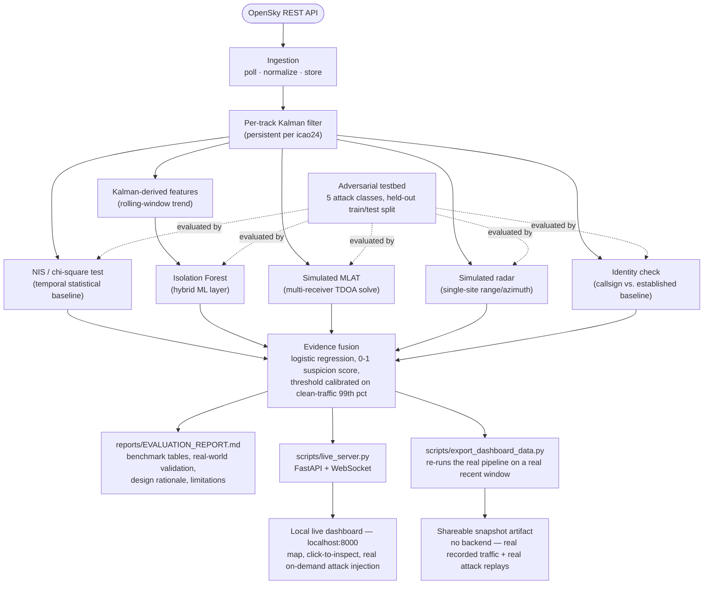

# ADS-B Spoofing & Anomaly Detection System

A software-only ADS-B (aircraft surveillance) spoofing and anomaly detection pipeline. It ingests live
aircraft state vectors from [OpenSky Network](https://opensky-network.org/), models each aircraft's
expected physical behavior with a per-track Kalman filter, cross-checks broadcast positions against two
independent **simulated** verification sources (multilateration and primary radar), and detects
spoofed/anomalous aircraft using a hybrid statistical + ML + identity-consistency approach fused into a
single suspicion score. Every detection method is benchmarked against the others with a synthetic
adversarial testbed (five attack classes, held-out train/test evaluation, one class excluded from training
entirely to test generalization), validated against real, externally documented GPS interference activity,
and made explorable through two interactive dashboards built on top of the same real pipeline code.

> **Simulated components.** The multilateration (MLAT) and primary radar cross-checks in this project are
> software simulations built for this project — there are no real ground receivers or radar sites
> anywhere in this pipeline. This is stated here, in the code, in the evaluation report, and on the
> dashboards; it should never be read as, or presented as, live independent sensor corroboration.

**→ Full results, benchmark tables, and design rationale:
[`reports/EVALUATION_REPORT.md`](reports/EVALUATION_REPORT.md)**
**→ Layer-by-layer walkthrough, real-world comparison, and portfolio assessment:
[`PROJECT_DEEP_DIVE.txt`](PROJECT_DEEP_DIVE.txt)**

## Results at a glance

Full tables, methodology, and per-method breakdowns are in
[`reports/EVALUATION_REPORT.md`](reports/EVALUATION_REPORT.md); every number below is the **fused**
evidence score's performance on the **test split** (never seen during training/calibration).

| Attack class | Fused F1 | Notes |
|---|---|---|
| Ghost aircraft injection | 97.4% | MLAT/radar alone hit 100% — no physical target exists to corroborate |
| Position spoofing / drift | 92.6% | MLAT carries this class; NIS/ML alone are weak on subtle drift |
| Replay attack | 100.0% | Every detector agrees |
| Track hijacking (**held out — never trained on**) | 99.9% | Real cross-class generalization, not memorization |
| ICAO identity collision | **70.4%** | Hardest class for every method — MLAT/radar are structurally blind to it (position is real, only identity is fraudulent) |

- **Clean-traffic false-positive rate: 0.5%** (49 / 10,667 real rows), measured on 150 real tracks never
  used in fusion training or attack substrate construction.
- **Real-world validation** (Kaliningrad/Baltic corridor, a documented, ongoing GPS-jamming region): NIS
  flagged **2.7x** more often and ML flagged **3.8x** more often than in a matched clean control window —
  a plausibility check, not a labeled evaluation (see Limitations), but a genuine signal with an honest
  explanation of why MLAT/radar did not show the same lift.
- **125 tests**, all passing.

## Highlights

- **125 unit tests**, all passing — Kalman filter math, NIS calculation, MLAT/radar solvers, attack
  generators, held-out split logic, metrics, and evidence fusion are all directly tested, not just
  exercised end-to-end.
- **Real bugs found and fixed through empirical verification against live data, with before/after
  numbers, not just unit tests:**
  - A Kalman-filter process-noise mistuning that inflated the clean-traffic false-positive rate ~5x before
    retuning against real clean traffic.
  - An MLAT receiver-network coverage gap that produced 358km "disagreement" values from bad geometry
    alone, not noise — fixed by extending the receiver network to actually bracket the polling area.
  - A schema gap where `track_state` silently discarded callsign after ingestion, discovered while building
    the identity-consistency check (migration `006_track_state_callsign.sql`).
  - A pairwise identity-check design flaw that only flagged the exact row where a callsign changed, missing
    the rest of the fraudulent segment — measured at 10% recall. Redesigned as a stateful tracker
    comparing against each track's established baseline instead of the previous row; recall rose to
    31.5% (86.8% precision), lifting fused F1 on ICAO collision from 61.7% to 70.4%.
- **Held-out evaluation, not self-graded homework**: attack variants are split train/test per class
  (stratified by severity), one entire attack class (`track_hijack`) is excluded from training and only
  ever evaluated at test time, and clean-traffic false-positive rate is measured on tracks never used in
  training or attack construction. Every number in the benchmark tables is from the test split.
- **Two working dashboards, not screenshots** — a continuously-live local dashboard (real WebSocket stream
  off the real pipeline, real on-demand attack injection) and a shareable snapshot artifact, both driven by
  the exact same detection code as the benchmark, not a mocked-up frontend. See
  [Interactive dashboards](#interactive-dashboards) below.

## Architecture



Six detection methods are benchmarked against each other: a naive rule-based baseline, the NIS statistical
test, the hybrid Kalman+ML layer, simulated MLAT, simulated radar, and identity consistency — combined into
a seventh, the fused evidence score.

## Interactive dashboards

Both dashboards render the *same* map component and call into the *same* Python detection code as the
benchmark — they are viewers into the real pipeline, not a separate demo built to look good.

### Local live dashboard (`scripts/live_server.py`)

A FastAPI service that polls the database the `ingestion` container is continuously writing to, feeds every
new real row through a **persistent** per-track Kalman filter + ML + MLAT + radar + identity + fusion
pipeline (state carried across polls, not reprocessed from scratch), and pushes results to the browser over
a WebSocket as they happen.

- **Flat 2D map** (real coastlines + country borders from Natural Earth data, not satellite tiles) with
  aircraft rendered as heading-oriented plane icons — gold for normal traffic, red the instant a broadcast's
  fused suspicion score crosses its calibrated threshold.
- **Click any aircraft** for a live-updating card: altitude, speed, heading, position, and its real current
  detector snapshot (NIS, ML score, MLAT/radar disagreement in meters, fusion suspicion, per-method flags).
- **Inject a real attack on demand**: pick one of the 5 attack classes and a severity, and the server pulls
  a real recent track as substrate, runs the actual attack-generator and `evaluate_scenario()` code from the
  Phase 6/7 benchmark, and streams the real per-point verdicts back to animate on the map and populate the
  detector readout — a genuine on-demand pipeline run, not a canned response.
- A flagged-rate stat bar and periodic heartbeat log line keep the event log honest about scale (it only
  ever prints flagged events, so without a visible denominator a short burst reads as "everything is
  anomalous" at the true ~1–2% background rate).

Run it:

```
docker compose up -d           # db + ingestion must be running
.venv\Scripts\python.exe scripts\live_server.py
```

Then open **http://localhost:8000**. Needs a few minutes of accumulated ingestion data and one fusion-model
fit (logged as `fusion_fit_complete`) before attack injection and fused flags are meaningful.

### Shareable snapshot artifact

Because a published web page can't call a database or the OpenSky API at runtime (browser sandboxing), the
portable version instead embeds a **real, timestamped snapshot**: `scripts/export_dashboard_data.py`
re-runs the actual pipeline against a real recent OpenSky window, computing real detector output for both
recorded clean traffic and a handful of real attack-generator variants per class, and writes it to
`reports/dashboard_snapshot.json` for the page to load and replay. Two tabs:

- **Live traffic** — a real recorded aircraft list and map, with a "replay recorded window" button that
  re-plays real positions in true chronological order, and click-to-inspect on any aircraft.
- **Attack simulator** — the same 5 attack classes, severity slider snapped to a handful of real
  precomputed variants per class, replayed point-by-point with real per-point detector verdicts.

Regenerate the snapshot against fresh data with `python scripts/export_dashboard_data.py`.

## Project layout

```
config/config.yaml          All thresholds, bboxes, receiver networks, model hyperparameters — externalized, nothing hardcoded
src/absproj/
  ingestion/                 OpenSky client (OAuth2 + anonymous fallback), normalization, polling loop
  storage/                   DB migrations, repository (all SQL lives here)
  tracking/                  Kalman filter, NIS/chi-square, category-based dynamics buckets
  ml/                        Feature engineering + Isolation Forest wrapper
  verification/              Simulated MLAT + simulated radar
  attacks/                   5 attack generators, substrate pool, held-out train/test split
  evaluation/                Rule-based baseline, identity check, metrics, evidence fusion, scenario pipeline
scripts/
  run_ingestion.py           Live polling loop (also the ingestion Docker service)
  run_kalman.py / run_mlat.py / run_radar.py   Batch detector passes over accumulated traffic
  train_isolation_forest.py  Trains the ML layer, compares to NIS
  verify_attacks.py          Generates all 5 attack classes + held-out split
  run_evaluation.py          Full benchmark → reports/phase7_benchmark.json
  collect_jamming_zone.py / run_jamming_zone_evaluation.py   Phase 8 real-world validation
  generate_report.py         Builds reports/EVALUATION_REPORT.md
  export_dashboard_data.py   Re-runs the real pipeline on a real recent window → reports/dashboard_snapshot.json
  live_server.py             FastAPI + WebSocket local live dashboard backend
  live_client.html           Local live dashboard frontend (served by live_server.py)
tests/                       125 tests, one file per module above
reports/                     EVALUATION_REPORT.md, phase7_benchmark.json, phase8_jamming_zone.json, dashboard_snapshot.json
```

## Setup

1. Copy `.env.example` to `.env`. Add your OpenSky `OPENSKY_CLIENT_ID` / `OPENSKY_CLIENT_SECRET`
   (register at [opensky-network.org/my-opensky](https://opensky-network.org/my-opensky) → API Client) —
   anonymous access works but is heavily rate-limited and will exhaust its daily quota under continuous
   polling.
2. Create a virtualenv and install dependencies:
   ```
   python -m venv .venv
   .venv\Scripts\activate
   pip install -r requirements.txt
   ```
   (`fastapi`/`uvicorn` are only needed for the local live dashboard — everything else runs without them.)
3. Bring up the database and apply the schema:
   ```
   docker compose up -d db
   python scripts/migrate.py
   ```
4. Run the ingestion poller — locally, or as part of the full Docker stack:
   ```
   python scripts/run_ingestion.py
   # or:
   docker compose up -d
   ```

## Running the pipeline

Each stage is its own script; run them in order once you have accumulated some real traffic via ingestion.

| Script | What it does |
|---|---|
| `scripts/run_ingestion.py` | Continuously polls OpenSky, stores normalized state vectors |
| `scripts/run_kalman.py` | Batch: Kalman filter + NIS over all accumulated airborne traffic |
| `scripts/train_isolation_forest.py` | Trains the ML layer on Kalman-derived features, compares to NIS |
| `scripts/run_mlat.py` / `scripts/run_radar.py` | Batch: simulated MLAT / radar checks over accumulated traffic |
| `scripts/verify_attacks.py` | Generates all 5 attack classes + held-out split, sanity-checks against real substrate |
| `scripts/run_evaluation.py` | Full benchmark: every method × every attack class × clean-traffic FPR, writes `reports/phase7_benchmark.json` |
| `scripts/collect_jamming_zone.py` | Bounded live collection over a documented GPS-interference region |
| `scripts/run_jamming_zone_evaluation.py` | Compares detection activity: interference zone vs. clean control |
| `scripts/generate_report.py` | Builds `reports/EVALUATION_REPORT.md` from the JSON benchmark data |
| `scripts/export_dashboard_data.py` | Re-runs the real pipeline on a real recent window, writes `reports/dashboard_snapshot.json` |
| `scripts/live_server.py` | Starts the local live dashboard at `http://localhost:8000` |

## Tests

```
pytest
```

125 tests covering the Kalman filter's math directly (not just end-to-end), the NIS chi-square test, the
MLAT/radar solvers (including zero-noise exact-recovery checks), every attack generator's structural
correctness, the held-out split's disjointness/stratification guarantees, the stateful identity tracker,
and the evidence-fusion model.

## Configuration

Every threshold, bounding box, receiver network, and model hyperparameter lives in `config/config.yaml` —
nothing is hardcoded in code. Secrets (API credentials, DB password) live in `.env`, which is git-ignored.

## Limitations

Stated in full, with reasoning, in [`reports/EVALUATION_REPORT.md`](reports/EVALUATION_REPORT.md) Section
8. In short:

- **MLAT and radar are simulations**, not real sensors — there's no RF-layer verification or satellite-based
  ADS-B sources anywhere in this pipeline.
- **Real ADS-B integrity fields (NIC/NACp/SIL/SDA) aren't used.** These are real self-reported
  confidence/accuracy fields defined in the ADS-B standard, but OpenSky's public REST API — the data source
  this project is built on — doesn't expose them; using them would require decoding raw Mode S transponder
  messages directly (SDR hardware + a Mode S decoder), which is out of scope for a software-only project.
- **No k-fold cross-validation or confidence intervals.** Every reported metric comes from one random
  seed/split, not repeated resampling — the relative ordering of results (collision hardest, replay
  easiest, MLAT beats radar on drift) is robust given the size of the gaps, but exact decimal values
  haven't been validated against run-to-run variance.
- **Real-world validation (Phase 8) is a plausibility check, not a labeled evaluation** — real interference
  doesn't come with per-broadcast ground-truth labels the way synthetic attacks do.
- **ICAO identity collision remains the hardest attack class for every method** (~70% F1 at best), since
  position-truth checks (MLAT/radar) are structurally blind to an attack where the position is real and
  only the identity is fraudulent.

## License / attribution

Uses live data from the [OpenSky Network](https://opensky-network.org/). Not affiliated with OpenSky.
